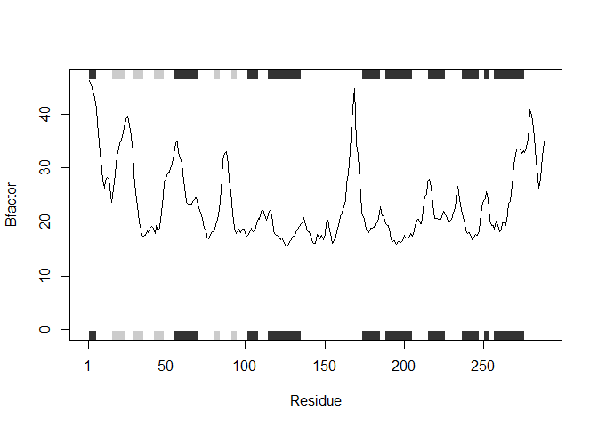

class06PDBReader
================
Terry Lin
10/18/2019

``` r
#function read any type of pdb protein structure and plot on bio3d
read<- function(x){ 
  #checks if the bio3d package is available & downloads necessary functions
  require(bio3d)
  #4 letter PDB code
  name<- read.pdb(x)
  #trim pdb on chain A
  name.chainA<- trim.pdb(name, chain="A", elety="CA")
  #select b column of trimmed pdb file
  name.b<- name.chainA$atom$b
  #plotb3 of original structure, with secondary trimmed structrue, in line format.
  plotb3(name.b,sse=name.chainA, typ="l", ylab="Bfactor")
}
#in place of code, put your 4 letter pdb code
#read("code")
read("3FXX")
```

    ## Loading required package: bio3d

    ##   Note: Accessing on-line PDB file
    ##    PDB has ALT records, taking A only, rm.alt=TRUE

<!-- -->
