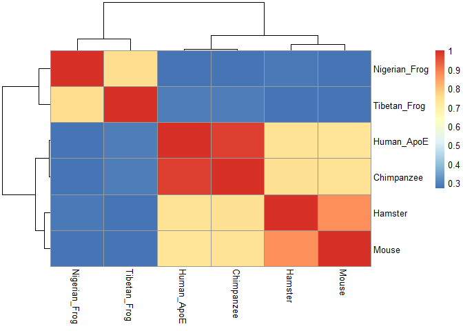

Untitled
================

``` r
library(bio3d)
library(pheatmap)
```

``` r
apoe<-read.fasta("apoe_fasta.clw")
seqid<-seqidentity(apoe)

pheatmap(seqid)
```

<!-- -->

``` r
frog<-read.fasta("apoe_nanorana.txt")
pdbs <- blast.pdb(frog)
```

    ##  Searching ... please wait (updates every 5 seconds) RID = YGM6HGAT014 
    ##  ..
    ##  Reporting 69 hits

``` r
pdbsdf <- as.data.frame(pdbs$hit.tbl)
sorted <- pdbsdf[order(pdbsdf$identity,decreasing=TRUE),]
sorted
```

    ##        queryid subjectids identity alignmentlength mismatches gapopens
    ## 7  Query_15979     5W8V_A   45.238             210        112        2
    ## 1  Query_15979     5BSK_A   44.700             217        117        2
    ## 2  Query_15979     6BNJ_A   44.700             217        117        2
    ## 3  Query_15979     5HIA_A   44.700             217        117        2
    ## 4  Query_15979     1HMP_A   43.256             215        120        1
    ## 5  Query_15979     4KN6_A   43.256             215        120        1
    ## 6  Query_15979     4IJQ_A   43.256             215        120        1
    ## 8  Query_15979     1D6N_A   42.723             213        120        1
    ## 9  Query_15979     2VFA_A   40.654             214        125        1
    ## 10 Query_15979     2JBH_A   40.376             213        125        1
    ## 53 Query_15979     6P91_A   38.333              60         31        2
    ## 54 Query_15979     5VK2_A   38.333              60         31        2
    ## 11 Query_15979     1CJB_A   37.327             217        130        2
    ## 12 Query_15979     3OZF_A   37.327             217        130        2
    ## 24 Query_15979     6IGS_A   37.267             161         92        2
    ## 19 Query_15979     1G9S_A   36.782             174         97        5
    ## 13 Query_15979     5IPF_A   36.453             203        124        2
    ## 64 Query_15979     4ZN9_A   36.364              44         28        0
    ## 65 Query_15979     5HYR_A   36.364              44         28        0
    ## 66 Query_15979     2OCF_A   36.364              44         28        0
    ## 21 Query_15979     5KNR_A   36.207             174         98        5
    ## 18 Query_15979     4QRI_A   36.196             163         94        3
    ## 14 Query_15979     6BO7_A   35.780             218        134        3
    ## 15 Query_15979     1DBR_A   35.714             210        129        2
    ## 16 Query_15979     1QK3_A   35.714             210        129        2
    ## 20 Query_15979     1J7J_A   35.632             174         99        5
    ## 36 Query_15979     3ACB_A   35.366             164         95        5
    ## 22 Query_15979     4QYI_B   35.260             173        101        4
    ## 23 Query_15979     3O7M_A   35.260             173        101        4
    ## 17 Query_15979     1QK5_A   35.238             210        130        2
    ## 37 Query_15979     1I14_A   34.014             147         91        3
    ## 38 Query_15979     1I0L_A   34.014             147         91        3
    ## 39 Query_15979     1I0I_A   34.014             147         91        3
    ## 41 Query_15979     1I13_A   34.014             147         91        3
    ## 40 Query_15979     1R3U_A   33.898             177        108        3
    ## 32 Query_15979     1TC2_A   33.766             154         96        3
    ## 33 Query_15979     1TC1_A   33.766             154         96        3
    ## 34 Query_15979     5EUC_A   33.766             154         96        3
    ## 30 Query_15979     1PZM_A   33.553             152         95        3
    ## 43 Query_15979     2GEB_A   33.146             178        110        3
    ## 35 Query_15979     1P17_A   33.117             154         97        3
    ## 28 Query_15979     3OHP_A   32.749             171        107        2
    ## 47 Query_15979     4LYY_A   32.704             159         99        2
    ## 25 Query_15979     6D9Q_A   31.492             181        113        4
    ## 45 Query_15979     5KNP_A   31.472             197        116        5
    ## 46 Query_15979     4RHT_A   31.472             197        116        5
    ## 42 Query_15979     6AR9_B   31.410             156        101        3
    ## 48 Query_15979     6AQO_A   30.769             156        102        3
    ## 26 Query_15979     3H83_A   30.526             190        121        4
    ## 31 Query_15979     4RQA_A   30.508             177        114        3
    ## 56 Query_15979     4TWB_A   30.435              69         43        2
    ## 60 Query_15979     2JKY_A   30.159              63         41        1
    ## 61 Query_15979     2XBU_A   30.159              63         41        1
    ## 62 Query_15979     2JKZ_A   30.159              63         41        1
    ## 29 Query_15979     4PFQ_A   30.000             180        117        3
    ## 51 Query_15979     1VDM_A   29.897              97         55        2
    ## 27 Query_15979     1HGX_A   28.889             180        119        3
    ## 49 Query_15979     5ESX_A   27.922             154        101        3
    ## 50 Query_15979     5ESW_A   27.922             154        101        3
    ## 68 Query_15979     4S2U_A   27.660              47         29        1
    ## 69 Query_15979     6ASV_A   27.660              47         29        1
    ## 55 Query_15979     5VOG_A   27.586              58         42        0
    ## 63 Query_15979     5ORI_A   27.273              77         55        1
    ## 58 Query_15979     2FXV_A   27.160              81         55        2
    ## 59 Query_15979     1Y0B_A   27.160              81         55        2
    ## 44 Query_15979     5JSQ_A   26.943             193        128        4
    ## 52 Query_15979     4Z1O_A   25.806              93         65        2
    ## 57 Query_15979     3M3H_A   25.806              93         60        3
    ## 67 Query_15979     4CEK_A   22.059              68         53        0
    ##    q.start q.end s.start s.end   evalue bitscore positives  mlog.evalue
    ## 7        8   214       5   214 4.52e-58    183.0     62.86 132.04142340
    ## 1        1   214       1   217 5.72e-60    188.0     62.21 136.41113677
    ## 2        1   214       1   217 1.98e-59    186.0     62.21 135.16942364
    ## 3        1   214       7   223 2.38e-59    186.0     62.21 134.98542000
    ## 4        2   214       2   216 3.47e-58    183.0     61.86 132.30578080
    ## 5        2   214       1   215 3.59e-58    183.0     61.86 132.27178319
    ## 6        2   214       8   222 4.17e-58    183.0     61.86 132.12201936
    ## 8        4   214       1   213 2.15e-56    179.0     61.03 128.17929737
    ## 9        3   214      12   225 7.32e-53    170.0     60.75 120.04639960
    ## 10       4   214      12   224 2.42e-52    169.0     60.56 118.85065730
    ## 53      39    92       2    61 6.70e-01     31.6     53.33   0.40047757
    ## 54      39    92       2    61 6.90e-01     31.6     53.33   0.37106368
    ## 11       3   214      12   227 3.21e-42    143.0     57.14  95.54230297
    ## 12       3   214      31   246 4.61e-42    143.0     57.14  95.18034605
    ## 24      45   203      21   174 3.06e-25     97.8     57.76  56.44621241
    ## 19      34   203      11   175 2.21e-28    106.0     59.77  63.67939009
    ## 13      16   213      39   241 3.03e-41    141.0     57.64  93.29742619
    ## 64     110   153     216   259 4.50e+00     28.9     54.55  -1.50407740
    ## 65     110   153     215   258 4.60e+00     28.9     54.55  -1.52605630
    ## 66     110   153     219   262 4.90e+00     28.9     54.55  -1.58923521
    ## 21      34   203      11   175 6.66e-28    104.0     59.77  62.57626312
    ## 18      44   205      45   198 2.07e-29    109.0     60.74  66.04741909
    ## 14       2   214      16   232 2.46e-39    135.0     57.34  88.90065728
    ## 15      10   214      21   229 2.82e-38    133.0     56.67  86.46149665
    ## 16      10   214      24   232 3.94e-38    132.0     56.67  86.12705281
    ## 20      34   203       7   171 6.40e-28    104.0     59.20  62.61608461
    ## 36      44   205      22   176 2.38e-21     87.8     56.10  47.48718647
    ## 22      35   205      12   175 5.99e-26     99.8     58.96  58.07712101
    ## 23      35   205      12   175 9.08e-26     99.4     58.96  57.66113823
    ## 17      10   214      24   232 5.03e-37    129.0     56.19  83.58022846
    ## 37      60   205      44   185 3.24e-21     88.6     58.50  47.17871362
    ## 38      60   205      44   185 3.99e-21     88.2     58.50  46.97049572
    ## 39      60   205      44   185 5.88e-21     87.8     57.82  46.58273019
    ## 41      60   205      44   185 9.52e-21     87.0     57.82  46.10089210
    ## 40      30   205      31   199 6.93e-21     87.0     55.37  46.41842714
    ## 32      60   212      44   192 7.23e-22     90.1     57.14  48.67863301
    ## 33      60   212      43   191 7.62e-22     90.1     57.14  48.62609568
    ## 34      60   212      44   192 8.40e-22     90.1     57.14  48.52864034
    ## 30      57   207      55   201 6.06e-22     90.1     58.55  48.85516225
    ## 43      30   206      11   180 1.43e-20     85.9     55.06  45.69402742
    ## 35      60   212      44   192 1.52e-21     89.4     57.14  47.93557662
    ## 28      34   203       7   170 1.12e-23     93.6     56.73  52.84612845
    ## 47      48   205      43   194 1.03e-19     84.0     54.72  43.71955796
    ## 25      30   208       8   179 2.89e-24     95.5     56.35  54.20078573
    ## 45      20   205      13   201 7.89e-20     84.3     51.78  43.98610573
    ## 46      20   205       7   195 8.25e-20     84.3     51.78  43.94148866
    ## 42      60   213     117   268 1.14e-20     88.2     55.13  45.92067360
    ## 48      60   213     117   268 4.86e-19     83.6     54.49  42.16807833
    ## 26      21   208      20   200 4.64e-24     95.5     54.74  53.72732787
    ## 31      30   205      11   179 6.49e-22     89.4     55.37  48.78660952
    ## 56     107   171     193   260 1.10e+00     30.8     59.42  -0.09531018
    ## 60     121   183      99   158 2.90e+00     29.3     52.38  -1.06471074
    ## 61     121   183     100   159 3.20e+00     29.3     52.38  -1.16315081
    ## 62     121   183      99   158 3.40e+00     29.3     52.38  -1.22377543
    ## 29      30   208      32   203 4.43e-23     92.8     53.89  51.47105755
    ## 51      92   179      51   143 2.25e-04     41.2     47.42   8.39941016
    ## 27      30   208       9   180 7.28e-24     94.4     57.78  53.27691137
    ## 49      47   198      35   180 3.68e-17     77.0     53.25  37.84103383
    ## 50      47   198      37   182 3.99e-17     77.0     53.90  37.76015535
    ## 68     111   157     206   247 5.40e+00     28.9     61.70  -1.68639895
    ## 69     111   157     225   266 5.70e+00     28.9     61.70  -1.74046617
    ## 55     122   179      96   153 6.90e-01     31.2     55.17   0.37106368
    ## 63      75   150     473   549 4.10e+00     29.3     42.86  -1.41098697
    ## 58      84   163      79   156 2.30e+00     29.6     48.15  -0.83290912
    ## 59      84   163      82   159 2.90e+00     29.3     48.15  -1.06471074
    ## 44      24   208       9   196 5.54e-20     85.1     52.33  44.33970736
    ## 52      94   186      56   144 6.30e-02     34.3     48.39   2.76462055
    ## 57      92   182     112   197 1.80e+00     30.0     50.54  -0.58778666
    ## 67      47   114     174   241 4.90e+00     28.9     45.59  -1.58923521
    ##    pdb.id    acc
    ## 7  5W8V_A 5W8V_A
    ## 1  5BSK_A 5BSK_A
    ## 2  6BNJ_A 6BNJ_A
    ## 3  5HIA_A 5HIA_A
    ## 4  1HMP_A 1HMP_A
    ## 5  4KN6_A 4KN6_A
    ## 6  4IJQ_A 4IJQ_A
    ## 8  1D6N_A 1D6N_A
    ## 9  2VFA_A 2VFA_A
    ## 10 2JBH_A 2JBH_A
    ## 53 6P91_A 6P91_A
    ## 54 5VK2_A 5VK2_A
    ## 11 1CJB_A 1CJB_A
    ## 12 3OZF_A 3OZF_A
    ## 24 6IGS_A 6IGS_A
    ## 19 1G9S_A 1G9S_A
    ## 13 5IPF_A 5IPF_A
    ## 64 4ZN9_A 4ZN9_A
    ## 65 5HYR_A 5HYR_A
    ## 66 2OCF_A 2OCF_A
    ## 21 5KNR_A 5KNR_A
    ## 18 4QRI_A 4QRI_A
    ## 14 6BO7_A 6BO7_A
    ## 15 1DBR_A 1DBR_A
    ## 16 1QK3_A 1QK3_A
    ## 20 1J7J_A 1J7J_A
    ## 36 3ACB_A 3ACB_A
    ## 22 4QYI_B 4QYI_B
    ## 23 3O7M_A 3O7M_A
    ## 17 1QK5_A 1QK5_A
    ## 37 1I14_A 1I14_A
    ## 38 1I0L_A 1I0L_A
    ## 39 1I0I_A 1I0I_A
    ## 41 1I13_A 1I13_A
    ## 40 1R3U_A 1R3U_A
    ## 32 1TC2_A 1TC2_A
    ## 33 1TC1_A 1TC1_A
    ## 34 5EUC_A 5EUC_A
    ## 30 1PZM_A 1PZM_A
    ## 43 2GEB_A 2GEB_A
    ## 35 1P17_A 1P17_A
    ## 28 3OHP_A 3OHP_A
    ## 47 4LYY_A 4LYY_A
    ## 25 6D9Q_A 6D9Q_A
    ## 45 5KNP_A 5KNP_A
    ## 46 4RHT_A 4RHT_A
    ## 42 6AR9_B 6AR9_B
    ## 48 6AQO_A 6AQO_A
    ## 26 3H83_A 3H83_A
    ## 31 4RQA_A 4RQA_A
    ## 56 4TWB_A 4TWB_A
    ## 60 2JKY_A 2JKY_A
    ## 61 2XBU_A 2XBU_A
    ## 62 2JKZ_A 2JKZ_A
    ## 29 4PFQ_A 4PFQ_A
    ## 51 1VDM_A 1VDM_A
    ## 27 1HGX_A 1HGX_A
    ## 49 5ESX_A 5ESX_A
    ## 50 5ESW_A 5ESW_A
    ## 68 4S2U_A 4S2U_A
    ## 69 6ASV_A 6ASV_A
    ## 55 5VOG_A 5VOG_A
    ## 63 5ORI_A 5ORI_A
    ## 58 2FXV_A 2FXV_A
    ## 59 1Y0B_A 1Y0B_A
    ## 44 5JSQ_A 5JSQ_A
    ## 52 4Z1O_A 4Z1O_A
    ## 57 3M3H_A 3M3H_A
    ## 67 4CEK_A 4CEK_A

``` r
pdb.annotate("6cfe")
```

    ##        structureId chainId experimentalTechnique resolution ligandId
    ## 6CFE_A        6CFE       A     X-RAY DIFFRACTION       1.99     <NA>
    ##        ligandName       source scopDomain  classification
    ## 6CFE_A       <NA> Homo sapiens       <NA> LIPID TRANSPORT
    ##                                    compound
    ## 6CFE_A Mutant of Apolipoprotein E3 (APO-E3)
    ##                                                                                           title
    ## 6CFE_A Rationally designed carbohydrate-occluded epitopes elicit HIV-1 Env-specific antibodies.
    ##                                                                                                                                                                                                                             citationAuthor
    ## 6CFE_A Zhu, C., Dukhovlinova, E., Council, O., Ping, L., Faison, E.M., Prabhu, S.S., Potter, E.L., Upton, S.L., Yin, G., Fay, J.M., Kincer, L.P., Spielvogel, E., Campbell, S.L., Benhabbour, S.R., Ke, H., Swanstrom, R., Dokholyan, N.V.
    ##        journalName publicationYear
    ## 6CFE_A  Nat Commun            2019
    ##                                                                                                                      structureTitle
    ## 6CFE_A Crystal structure of C2S5: A computationally designed immunogen to target Carbohydrate-Occluded Epitopes on the HIV envelope
    ##        depositionDate structureMolecularWeight macromoleculeType entityId
    ## 6CFE_A     2018-02-14                 18643.04           Protein        1
    ##                                                                                                                                                               sequence
    ## 6CFE_A MGHHHHHHGSENLYFQGSGQRWELALGRFWDYLRWVQTLSEQVQEELLSSQVETKLNKLMQRTMEELKAYKSELEEQLTPVAEETRARLSKELQAAQARLGADMEDVCGRLVQYRGEVQAMLGQSTEELRVRLATHLNKLRQRLLEDADDLQKRLAVYQ
    ##        chainLength db_id db_name rObserved rFree spaceGroup
    ## 6CFE_A         159  6CFE     PDB     0.238 0.269   P 31 2 1
    ##                            citation
    ## 6CFE_A Zhu et al. Nat Commun (2019)

``` r
get.pdb("1QP8")
```

    ## Warning in get.pdb("1QP8"): ./1QP8.pdb exists. Skipping download

    ## [1] "./1QP8.pdb"

``` r
get.pdb("6CFE")
```

    ## Warning in get.pdb("6CFE"): ./6CFE.pdb exists. Skipping download

    ## [1] "./6CFE.pdb"

``` r
get.pdb("1Qp8")
```

    ## Warning in get.pdb("1Qp8"): ./1Qp8.pdb exists. Skipping download

    ## [1] "./1Qp8.pdb"
