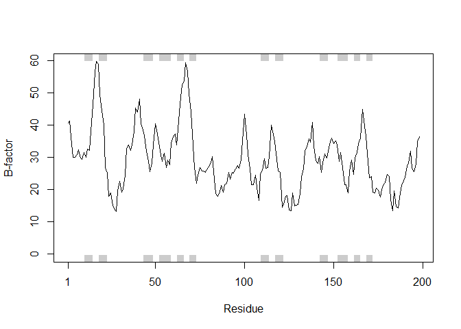

PDB
================

## What’s in the PDB database?

Percent of structures solved by Xray and Electron Microscopy

``` r
pdbstats <- read.csv("Data Export Summary.csv", row.names="Experimental.Method")
pdbstats
```

    ##                     Proteins Nucleic.Acids Protein.NA.Complex Other  Total
    ## X-Ray                 132157          2074               6789     8 141028
    ## NMR                    11253          1306                262     8  12829
    ## Electron Microscopy     2995            33               1025     0   4053
    ## Other                    282             4                  6    13    305
    ## Multi Method             144             5                  2     1    152

``` r
total <- sum(pdbstats$Total)
ans <- pdbstats$Total/total*100
names(ans) <- row.names(pdbstats)
round(ans,2)
```

    ##               X-Ray                 NMR Electron Microscopy 
    ##               89.05                8.10                2.56 
    ##               Other        Multi Method 
    ##                0.19                0.10

Proportion of structures that are proteins

``` r
proteins <- sum(pdbstats$Proteins)/sum(pdbstats$Total)
proteins
```

    ## [1] 0.9271565

``` r
library(bio3d)
pdb <- read.pdb("1HSG")
```

    ##   Note: Accessing on-line PDB file

``` r
pdb
```

    ## 
    ##  Call:  read.pdb(file = "1HSG")
    ## 
    ##    Total Models#: 1
    ##      Total Atoms#: 1686,  XYZs#: 5058  Chains#: 2  (values: A B)
    ## 
    ##      Protein Atoms#: 1514  (residues/Calpha atoms#: 198)
    ##      Nucleic acid Atoms#: 0  (residues/phosphate atoms#: 0)
    ## 
    ##      Non-protein/nucleic Atoms#: 172  (residues: 128)
    ##      Non-protein/nucleic resid values: [ HOH (127), MK1 (1) ]
    ## 
    ##    Protein sequence:
    ##       PQITLWQRPLVTIKIGGQLKEALLDTGADDTVLEEMSLPGRWKPKMIGGIGGFIKVRQYD
    ##       QILIEICGHKAIGTVLVGPTPVNIIGRNLLTQIGCTLNFPQITLWQRPLVTIKIGGQLKE
    ##       ALLDTGADDTVLEEMSLPGRWKPKMIGGIGGFIKVRQYDQILIEICGHKAIGTVLVGPTP
    ##       VNIIGRNLLTQIGCTLNF
    ## 
    ## + attr: atom, xyz, seqres, helix, sheet,
    ##         calpha, remark, call

``` r
attributes (pdb)
```

    ## $names
    ## [1] "atom"   "xyz"    "seqres" "helix"  "sheet"  "calpha" "remark" "call"  
    ## 
    ## $class
    ## [1] "pdb" "sse"

``` r
head(pdb$atom)
```

    ##   type eleno elety  alt resid chain resno insert      x      y     z o
    ## 1 ATOM     1     N <NA>   PRO     A     1   <NA> 29.361 39.686 5.862 1
    ## 2 ATOM     2    CA <NA>   PRO     A     1   <NA> 30.307 38.663 5.319 1
    ## 3 ATOM     3     C <NA>   PRO     A     1   <NA> 29.760 38.071 4.022 1
    ## 4 ATOM     4     O <NA>   PRO     A     1   <NA> 28.600 38.302 3.676 1
    ## 5 ATOM     5    CB <NA>   PRO     A     1   <NA> 30.508 37.541 6.342 1
    ## 6 ATOM     6    CG <NA>   PRO     A     1   <NA> 29.296 37.591 7.162 1
    ##       b segid elesy charge
    ## 1 38.10  <NA>     N   <NA>
    ## 2 40.62  <NA>     C   <NA>
    ## 3 42.64  <NA>     C   <NA>
    ## 4 43.40  <NA>     O   <NA>
    ## 5 37.87  <NA>     C   <NA>
    ## 6 38.40  <NA>     C   <NA>

``` r
pdb$atom[1:2,c("eleno", "elety", "x","y","z")]
```

    ##   eleno elety      x      y     z
    ## 1     1     N 29.361 39.686 5.862
    ## 2     2    CA 30.307 38.663 5.319

``` r
pdb$atom$elety[1:2]
```

    ## [1] "N"  "CA"

``` r
plot.bio3d(pdb$atom$b[pdb$calpha], sse=pdb, typ="l", ylab="B-factor")
```

<!-- -->

``` r
library(bio3d)
ca.inds <- atom.select(pdb, "calpha", value=TRUE)
ca.inds
```

    ## 
    ##  Call:  trim.pdb(pdb = pdb, sele)
    ## 
    ##    Total Models#: 1
    ##      Total Atoms#: 198,  XYZs#: 594  Chains#: 2  (values: A B)
    ## 
    ##      Protein Atoms#: 198  (residues/Calpha atoms#: 198)
    ##      Nucleic acid Atoms#: 0  (residues/phosphate atoms#: 0)
    ## 
    ##      Non-protein/nucleic Atoms#: 0  (residues: 0)
    ##      Non-protein/nucleic resid values: [ none ]
    ## 
    ##    Protein sequence:
    ##       PQITLWQRPLVTIKIGGQLKEALLDTGADDTVLEEMSLPGRWKPKMIGGIGGFIKVRQYD
    ##       QILIEICGHKAIGTVLVGPTPVNIIGRNLLTQIGCTLNFPQITLWQRPLVTIKIGGQLKE
    ##       ALLDTGADDTVLEEMSLPGRWKPKMIGGIGGFIKVRQYDQILIEICGHKAIGTVLVGPTP
    ##       VNIIGRNLLTQIGCTLNF
    ## 
    ## + attr: atom, helix, sheet, seqres, xyz,
    ##         calpha, call

``` r
trimprot <- function(x){
  a<-read.pdb(x)
  select<- atom.select(a,"protein",value=TRUE)
  write.pdb(a, file="1hsg_protein.pdb")
}

trimlig <- function(x){
  a<-read.pdb(x)
  select<- atom.select(a,"ligand",value=TRUE)
  write.pdb(a,file="1hsg_ligand.pdb")
}

prot<-trimprot("1HSG")
```

    ##   Note: Accessing on-line PDB file

    ## Warning in get.pdb(file, path = tempdir(), verbose = FALSE): C:
    ## \Users\Terry\AppData\Local\Temp\RtmpWQNlt7/1HSG.pdb exists. Skipping
    ## download

``` r
lig<-trimlig("1HSG")
```

    ##   Note: Accessing on-line PDB file

    ## Warning in get.pdb(file, path = tempdir(), verbose = FALSE): C:
    ## \Users\Terry\AppData\Local\Temp\RtmpWQNlt7/1HSG.pdb exists. Skipping
    ## download
