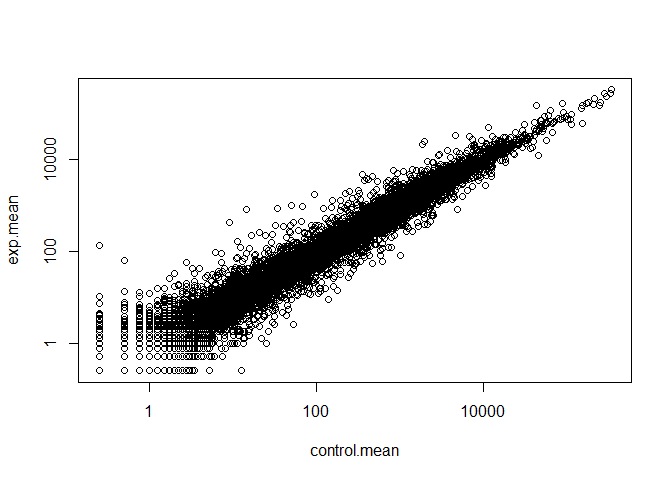
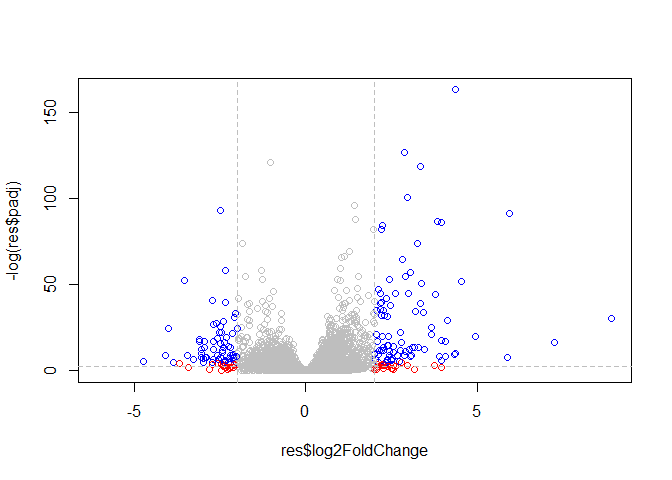

Transcriptomics and RNA-seq Analysis
================

## Setup Bioconductor DESeq2

``` r
install.packages("BiocManager")
BiocManager::install()
# For this class, you'll also need DESeq2:
BiocManager::install("DESeq2")
```

## Data for today’s class

``` r
counts <- read.csv("airway_scaledcounts.csv", stringsAsFactors = FALSE)
metadata <- read.csv("airway_metadata.csv", stringsAsFactors = FALSE)


head(counts)
```

    ##           ensgene SRR1039508 SRR1039509 SRR1039512 SRR1039513 SRR1039516
    ## 1 ENSG00000000003        723        486        904        445       1170
    ## 2 ENSG00000000005          0          0          0          0          0
    ## 3 ENSG00000000419        467        523        616        371        582
    ## 4 ENSG00000000457        347        258        364        237        318
    ## 5 ENSG00000000460         96         81         73         66        118
    ## 6 ENSG00000000938          0          0          1          0          2
    ##   SRR1039517 SRR1039520 SRR1039521
    ## 1       1097        806        604
    ## 2          0          0          0
    ## 3        781        417        509
    ## 4        447        330        324
    ## 5         94        102         74
    ## 6          0          0          0

``` r
head(metadata)
```

    ##           id     dex celltype     geo_id
    ## 1 SRR1039508 control   N61311 GSM1275862
    ## 2 SRR1039509 treated   N61311 GSM1275863
    ## 3 SRR1039512 control  N052611 GSM1275866
    ## 4 SRR1039513 treated  N052611 GSM1275867
    ## 5 SRR1039516 control  N080611 GSM1275870
    ## 6 SRR1039517 treated  N080611 GSM1275871

``` r
##how many genes
nrow(counts)
```

    ## [1] 38694

``` r
##how many experiments
ncol(counts)-1
```

    ## [1] 8

``` r
nrow(metadata)
```

    ## [1] 8

``` r
##Check if metadata id col matches colnames of counts
all(colnames(counts)[-1]==metadata$id)
```

    ## [1] TRUE

## Analysis: Compare control to drug treated

look at metadata$dex, select the controls mean counts for control
experiment (rowsum/ total number)

``` r
control <- metadata[metadata[,"dex"]=="control",]
control.mean <- rowSums(counts[, control$id])/length(control)
names(control.mean) <- counts$ensgene
```

## Create same data set for experimental

``` r
exp <- metadata[metadata[,"dex"]=="treated",]
exp.mean <- rowSums(counts[,exp$id])/length(exp)
names(exp.mean) <- counts$ensgene

head(exp.mean)
```

    ## ENSG00000000003 ENSG00000000005 ENSG00000000419 ENSG00000000457 
    ##          658.00            0.00          546.00          316.50 
    ## ENSG00000000460 ENSG00000000938 
    ##           78.75            0.00

``` r
head(control.mean)
```

    ## ENSG00000000003 ENSG00000000005 ENSG00000000419 ENSG00000000457 
    ##          900.75            0.00          520.50          339.75 
    ## ENSG00000000460 ENSG00000000938 
    ##           97.25            0.75

## Compare control vs treated

``` r
meancounts <- data.frame(control.mean,exp.mean)
colSums(meancounts)
```

    ## control.mean     exp.mean 
    ##     23005324     22196524

## Create scatterplot showing mean of treated against control with log scale

``` r
plot(control.mean, exp.mean, log = "xy")
```

    ## Warning in xy.coords(x, y, xlabel, ylabel, log): 15032 x values <= 0
    ## omitted from logarithmic plot

    ## Warning in xy.coords(x, y, xlabel, ylabel, log): 15281 y values <= 0
    ## omitted from logarithmic plot

<!-- -->

## FOld change

``` r
meancounts$log2fc <- log2(meancounts[,"exp.mean"]/meancounts[,"control.mean"])
head(meancounts)
```

    ##                 control.mean exp.mean      log2fc
    ## ENSG00000000003       900.75   658.00 -0.45303916
    ## ENSG00000000005         0.00     0.00         NaN
    ## ENSG00000000419       520.50   546.00  0.06900279
    ## ENSG00000000457       339.75   316.50 -0.10226805
    ## ENSG00000000460        97.25    78.75 -0.30441833
    ## ENSG00000000938         0.75     0.00        -Inf

## weird results, NaN = not a number, when you divide by 0, also weir result is -Inf when you take the log of 0. We want to exclude these samples.

``` r
x <- c(5,8,0,5)
x==0
```

    ## [1] FALSE FALSE  TRUE FALSE

``` r
which(x==0)
```

    ## [1] 3

``` r
y <- data.frame(happy=c(5,6,0,0),sad=c(0,5,5,0))
y==0
```

    ##      happy   sad
    ## [1,] FALSE  TRUE
    ## [2,] FALSE FALSE
    ## [3,]  TRUE FALSE
    ## [4,]  TRUE  TRUE

``` r
which(y==0)
```

    ## [1] 3 4 5 8

``` r
inds <-unique(which(y==0,arr.ind=TRUE)[,1])
y[inds,]
```

    ##   happy sad
    ## 3     0   5
    ## 4     0   0
    ## 1     5   0

\#\#get rid of genes with zeroes

``` r
zero.val <- which(meancounts[,1:2]==0, arr.ind=TRUE)

to.rm <- unique(zero.val[,1])
mycounts <- meancounts[-to.rm,]
head(mycounts)
```

    ##                 control.mean exp.mean      log2fc
    ## ENSG00000000003       900.75   658.00 -0.45303916
    ## ENSG00000000419       520.50   546.00  0.06900279
    ## ENSG00000000457       339.75   316.50 -0.10226805
    ## ENSG00000000460        97.25    78.75 -0.30441833
    ## ENSG00000000971      5219.00  6687.50  0.35769358
    ## ENSG00000001036      2327.00  1785.75 -0.38194109

``` r
## how many genes do I have left
nrow(mycounts)
```

    ## [1] 21817

## Differential Expression

``` r
up.ind <- mycounts$log2fc >2
down.ind <- mycounts$log2fc< (-2)
##true =1 and false =0, we can find how many genes are uprg or downreg by summing the vector.
sum(up.ind)
```

    ## [1] 250

``` r
sum(down.ind)
```

    ## [1] 367

\#\#Adding annotation data

``` r
anno <- read.csv("annotables_grch38.csv")
head(anno)
```

    ##           ensgene entrez   symbol chr     start       end strand
    ## 1 ENSG00000000003   7105   TSPAN6   X 100627109 100639991     -1
    ## 2 ENSG00000000005  64102     TNMD   X 100584802 100599885      1
    ## 3 ENSG00000000419   8813     DPM1  20  50934867  50958555     -1
    ## 4 ENSG00000000457  57147    SCYL3   1 169849631 169894267     -1
    ## 5 ENSG00000000460  55732 C1orf112   1 169662007 169854080      1
    ## 6 ENSG00000000938   2268      FGR   1  27612064  27635277     -1
    ##          biotype
    ## 1 protein_coding
    ## 2 protein_coding
    ## 3 protein_coding
    ## 4 protein_coding
    ## 5 protein_coding
    ## 6 protein_coding
    ##                                                                                                  description
    ## 1                                                          tetraspanin 6 [Source:HGNC Symbol;Acc:HGNC:11858]
    ## 2                                                            tenomodulin [Source:HGNC Symbol;Acc:HGNC:17757]
    ## 3 dolichyl-phosphate mannosyltransferase polypeptide 1, catalytic subunit [Source:HGNC Symbol;Acc:HGNC:3005]
    ## 4                                               SCY1-like, kinase-like 3 [Source:HGNC Symbol;Acc:HGNC:19285]
    ## 5                                    chromosome 1 open reading frame 112 [Source:HGNC Symbol;Acc:HGNC:25565]
    ## 6                          FGR proto-oncogene, Src family tyrosine kinase [Source:HGNC Symbol;Acc:HGNC:3697]

``` r
library(AnnotationDbi)
```

    ## Loading required package: stats4

    ## Loading required package: BiocGenerics

    ## Loading required package: parallel

    ## 
    ## Attaching package: 'BiocGenerics'

    ## The following objects are masked from 'package:parallel':
    ## 
    ##     clusterApply, clusterApplyLB, clusterCall, clusterEvalQ,
    ##     clusterExport, clusterMap, parApply, parCapply, parLapply,
    ##     parLapplyLB, parRapply, parSapply, parSapplyLB

    ## The following objects are masked from 'package:stats':
    ## 
    ##     IQR, mad, sd, var, xtabs

    ## The following objects are masked from 'package:base':
    ## 
    ##     anyDuplicated, append, as.data.frame, basename, cbind,
    ##     colnames, dirname, do.call, duplicated, eval, evalq, Filter,
    ##     Find, get, grep, grepl, intersect, is.unsorted, lapply, Map,
    ##     mapply, match, mget, order, paste, pmax, pmax.int, pmin,
    ##     pmin.int, Position, rank, rbind, Reduce, rownames, sapply,
    ##     setdiff, sort, table, tapply, union, unique, unsplit, which,
    ##     which.max, which.min

    ## Loading required package: Biobase

    ## Welcome to Bioconductor
    ## 
    ##     Vignettes contain introductory material; view with
    ##     'browseVignettes()'. To cite Bioconductor, see
    ##     'citation("Biobase")', and for packages 'citation("pkgname")'.

    ## Loading required package: IRanges

    ## Loading required package: S4Vectors

    ## 
    ## Attaching package: 'S4Vectors'

    ## The following object is masked from 'package:base':
    ## 
    ##     expand.grid

    ## 
    ## Attaching package: 'IRanges'

    ## The following object is masked from 'package:grDevices':
    ## 
    ##     windows

``` r
library(org.Hs.eg.db)
```

    ## 

``` r
columns(org.Hs.eg.db)
```

    ##  [1] "ACCNUM"       "ALIAS"        "ENSEMBL"      "ENSEMBLPROT" 
    ##  [5] "ENSEMBLTRANS" "ENTREZID"     "ENZYME"       "EVIDENCE"    
    ##  [9] "EVIDENCEALL"  "GENENAME"     "GO"           "GOALL"       
    ## [13] "IPI"          "MAP"          "OMIM"         "ONTOLOGY"    
    ## [17] "ONTOLOGYALL"  "PATH"         "PFAM"         "PMID"        
    ## [21] "PROSITE"      "REFSEQ"       "SYMBOL"       "UCSCKG"      
    ## [25] "UNIGENE"      "UNIPROT"

``` r
mycounts$Symbol <- mapIds(org.Hs.eg.db,
                     keys=row.names(mycounts), # Our genenames
                     keytype="ENSEMBL",        # The format of our genenames
                     column="SYMBOL",          # The new format we want to add
                     multiVals="first")
```

    ## 'select()' returned 1:many mapping between keys and columns

``` r
head(mycounts)
```

    ##                 control.mean exp.mean      log2fc   Symbol
    ## ENSG00000000003       900.75   658.00 -0.45303916   TSPAN6
    ## ENSG00000000419       520.50   546.00  0.06900279     DPM1
    ## ENSG00000000457       339.75   316.50 -0.10226805    SCYL3
    ## ENSG00000000460        97.25    78.75 -0.30441833 C1orf112
    ## ENSG00000000971      5219.00  6687.50  0.35769358      CFH
    ## ENSG00000001036      2327.00  1785.75 -0.38194109    FUCA2

\#\#we need significance alongside fold change

## Running DESeq2 analysis : everything above this is what DESeq will do for us. 1) average controls and experimentals

``` r
library(DESeq2)
```

    ## Loading required package: GenomicRanges

    ## Loading required package: GenomeInfoDb

    ## Loading required package: SummarizedExperiment

    ## Loading required package: DelayedArray

    ## Loading required package: matrixStats

    ## 
    ## Attaching package: 'matrixStats'

    ## The following objects are masked from 'package:Biobase':
    ## 
    ##     anyMissing, rowMedians

    ## Loading required package: BiocParallel

    ## 
    ## Attaching package: 'DelayedArray'

    ## The following objects are masked from 'package:matrixStats':
    ## 
    ##     colMaxs, colMins, colRanges, rowMaxs, rowMins, rowRanges

    ## The following objects are masked from 'package:base':
    ## 
    ##     aperm, apply, rowsum

``` r
dds <- DESeqDataSetFromMatrix(countData=counts, 
                              colData=metadata, 
                              design=~dex, 
                              tidy=TRUE)
```

    ## converting counts to integer mode

    ## Warning in DESeqDataSet(se, design = design, ignoreRank): some variables in
    ## design formula are characters, converting to factors

``` r
sizeFactors(dds)
```

    ## NULL

``` r
dispersions(dds)
```

    ## NULL

``` r
dds <- DESeq(dds)
```

    ## estimating size factors

    ## estimating dispersions

    ## gene-wise dispersion estimates

    ## mean-dispersion relationship

    ## final dispersion estimates

    ## fitting model and testing

``` r
res <- results(dds)
summary(res)
```

    ## 
    ## out of 25258 with nonzero total read count
    ## adjusted p-value < 0.1
    ## LFC > 0 (up)       : 1563, 6.2%
    ## LFC < 0 (down)     : 1188, 4.7%
    ## outliers [1]       : 142, 0.56%
    ## low counts [2]     : 9971, 39%
    ## (mean count < 10)
    ## [1] see 'cooksCutoff' argument of ?results
    ## [2] see 'independentFiltering' argument of ?results

``` r
resdf <- as.data.frame(res)
View(resdf)
summary(resdf)
```

    ##     baseMean        log2FoldChange       lfcSE            stat        
    ##  Min.   :     0.0   Min.   :-6.030   Min.   :0.057   Min.   :-15.894  
    ##  1st Qu.:     0.0   1st Qu.:-0.425   1st Qu.:0.174   1st Qu.: -0.643  
    ##  Median :     1.1   Median :-0.009   Median :0.445   Median : -0.027  
    ##  Mean   :   570.2   Mean   :-0.011   Mean   :1.136   Mean   :  0.045  
    ##  3rd Qu.:   201.8   3rd Qu.: 0.306   3rd Qu.:1.848   3rd Qu.:  0.593  
    ##  Max.   :329280.4   Max.   : 8.906   Max.   :3.534   Max.   : 18.422  
    ##                     NA's   :13436    NA's   :13436   NA's   :13436    
    ##      pvalue           padj      
    ##  Min.   :0.000   Min.   :0.000  
    ##  1st Qu.:0.168   1st Qu.:0.203  
    ##  Median :0.533   Median :0.606  
    ##  Mean   :0.495   Mean   :0.539  
    ##  3rd Qu.:0.800   3rd Qu.:0.866  
    ##  Max.   :1.000   Max.   :1.000  
    ##  NA's   :13578   NA's   :23549

\#volcano plot

``` r
mycol <- rep("gray", nrow(res))
mycol[abs(res$log2FoldChange)>2] <- "red"
inds <- (res$padj <0.01) & (abs(res$log2FoldChange)>2)
mycol[inds] <- "blue"

plot(res$log2FoldChange,-log(res$padj),col=mycol)
abline(v=c(-2,2), col="gray", lty=2)
abline(h=-log(0.1), col="gray", lty=2)
```

<!-- -->
