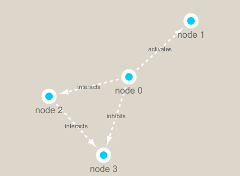

```{r setup, include=FALSE}
knitr::opts_chunk$set(echo = TRUE)
```

## Load libraries for Cytoscape, graphing, and color
```{r}
library(RCy3)
library(igraph)
library(RColorBrewer)
```

## Check if you are connected to cytoscape
```{r}
cytoscapePing()
cytoscapeVersionInfo()
```

## create simple graph and network which can be accessed by Cytoscape
```{r}
g <- makeSimpleIgraph()
createNetworkFromIgraph(g,"myGraph")
```

```{r}
fig <- exportImage(filename="demo", type="png", height=350)

```


```{r}
setVisualStyle("Marquee")
fig <- exportImage(filename="demo_marquee", type="png",height=350)

```


```{r}
styles <- getVisualStyleNames()
styles
```


##Reading our metagenomics data
```{r}
prok_vir_cor <- read.delim("virus_prok_cor_abundant.tsv")
head(prok_vir_cor)
g <- graph.data.frame(prok_vir_cor, directed = FALSE)
class(g)
g
plot(g)
```

```{r}
plot(g, vertex.size=3, vertex.label=NA)
V(g)
E(g)
```

##Network querys and set vertex/edge atrributes with V() and E()
##Network Community Detection
```{r}
cb <- cluster_edge_betweenness(g)
cb

```

```{r}
plot(cb, y=g, vertex.label=NA, vertex.size=3)
head(membership(cb))
```

## Node Degree
```{r}
library(BBmisc)
d <- degree(g)
hist(d, breaks=30, col="lightblue", main= "Node Degree Distribution")
plot(degree_distribution(g), type="h")
```

##Centrality Analysis
```{r}
pr <- page_rank(g)
head(pr$vector)
v.size <- BBmisc::normalize(pr$vector, range=c(2,20), method="range")
plot(g, vertex.size= v.size, vertex.label=NA)
```

## betweenness
```{r}
b <- betweenness(g)
v.size <- BBmisc::normalize(b, range=c(2,20),method="range")
plot(g, vertex.size=v.size, vertex.label=NA)
```


## Read taxonomic classificiation for network annotation
```{r}
phage_id_aff <- read.delim("phage_ids_with_affiliation.tsv")
bac_id_aff <- read.delim("prok_tax_from_silva.tsv")
head(bac_id_aff)
head(phage_id_aff)
```

```{r}
genenet.nodes <- as.data.frame(vertex.attributes(g), stringsAsFactors = FALSE)
head(genenet.nodes)
length( grep("^ph_", genenet.nodes[,1]))
```

```{r}
z <- bac_id_aff[,c("Accession_ID", "Kingdom", "Phylum", "Class")]
n <- merge(genenet.nodes, z, by.x="name", by.y="Accession_ID", all.x=TRUE)
head(n)
colnames(n)
colnames(phage_id_aff)
```

```{r}
y <- phage_id_aff[, c("first_sheet.Phage_id_network", "phage_affiliation", "Tax_order", "Tax_subfamily")]
x <- merge(x=n, y=y, by.x="name", by.y="first_sheet.Phage_id_network", all.x=TRUE)
x <- x[!duplicated((x$name)),]
head(x)
```

```{r}
genenet.nodes <- x
```


##Delete everything and clean workspace in Cytoscape
```{r}
deleteAllNetworks()
```

```{r}

```

